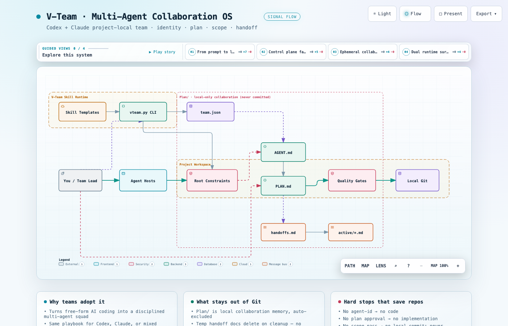
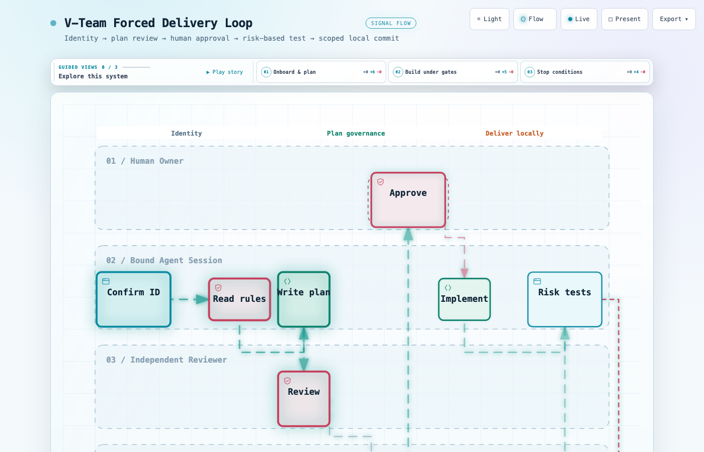

# V-Team

Codex / Claude 多 Agent 项目协作技能（调用名 `v-team`）。

在真实仓库里，给多个 Agent 约定身份、白名单、唯一活动计划、审批门禁、风险分级测试和提交前范围检查，并让协作文档落在本地 `Plan/`，不进产品 Git 历史。



交互图：[系统架构](assets/archify/v-team-system.html) · [交付工作流](assets/archify/v-team-workflow.html) · 更长说明见 [docs/PROJECT-INTRO.md](docs/PROJECT-INTRO.md)

## 解决什么问题

多 Agent 并行时常见问题：

- 没有身份：不清楚谁在改哪一块
- 没有边界：一个会话可能改到半个仓库
- 没有审批：计划还没确认，代码已经落地
- 没有证据：测试结论只存在聊天里
- 没有对接协议：前后端各自猜接口
- 没有清理：临时计划/对接文档污染仓库

V-Team 把这些约定落成可执行流程：

| 约定 | 落地方式 |
|------|----------|
| 身份与职责 | `Plan/agents/<id>/AGENT.md` + `Plan/team.json` |
| 唯一活动计划 | 每个 Agent 一份 `PLAN.md` |
| 先计划后实现 | review 通过 + 用户批准后才能写业务代码 |
| 提交前范围检查 | `check-scope` 只扫一次 staged diff |
| 计划 review 记录 | `check-plan` 校验固定 review 记录 |
| 协作材料不进 Git | 全部进本地 `Plan/`，完成或取消后清理 |
| 本地交付纪律 | 只做本地 `feat` / `fix` 提交，不 push、不 merge、不管分支 |

## 工作流



1. 确认 Agent ID（缺失则 onboarding）
2. 读根约束 + 个人 `AGENT.md`
3. 写唯一活动 `PLAN.md`
4. 独立 Agent 做计划 review
5. `check-plan` 校验 review 记录
6. 用户批准后才实现
7. 按风险跑测试（定向 / 相关回归 / 全仓）
8. stage 产品文件 → `check-scope`
9. 本地提交（中文语义，`feat` / `fix`）
10. 完成后 `cleanup`

硬停止条件：

- 身份不明 → 禁止实现
- 计划未批准 → 禁止实现
- 测试失败 → 禁止提交
- staged 含 `Plan/` → 拒绝
- 路径越界 → 当前提交一次性授权，不永久扩白名单

## 能力摘要

- Codex 生成 `AGENTS.md`，Claude 生成 `CLAUDE.md`，混合团队两者都生成
- 每个 Agent 独立身份、业务范围、模块映射、永久写入白名单
- 任务粒度按完整功能或明确修复，不按文件机械拆分
- 本地提交前只做一次 staged 范围检查
- 跨 Agent 对接写在 `Plan/collaboration/`，用 `handoff list` 精确读取、`handoff create` 建档，完成即删
- 零第三方 Python 依赖，Windows / macOS 可用

## 环境

- Python 3.9+
- 命令行可执行 `git`
- 不需要第三方 Python 包

路径含空格时加引号。若用 Conda，先激活环境，再用该环境的 `python` 执行。

## 快速使用

```bash
# 初始化（可重复 --runtime）
python scripts/vteam.py init --project-root /path/to/project --runtime codex
python scripts/vteam.py init --project-root /path/to/project --runtime codex --runtime claude

# 注册 Agent
python scripts/vteam.py agent \
  --project-root /path/to/project \
  --agent-id backend-1 \
  --runtime codex \
  --role backend \
  --responsibility "用户与权限后端" \
  --scope "用户与权限后端全部代码" \
  --module backend/auth \
  --allow backend/auth/ \
  --allow tests/auth/ \
  --read-doc Plan/collaboration/handoffs.md

# 门禁
python scripts/vteam.py check-plan  --project-root /path/to/project --agent-id backend-1
python scripts/vteam.py check-scope --project-root /path/to/project --agent-id backend-1
python scripts/vteam.py cleanup     --project-root /path/to/project --agent-id backend-1

# 对接：精确读取 / 一键创建 / 卫生检查
python scripts/vteam.py handoff list   --project-root /path/to/project --agent-id frontend-1
python scripts/vteam.py handoff create --project-root /path/to/project \
  --from backend-1 --to frontend-1 --topic login-api \
  --deliverable "登录接口" --acceptance "前端联调通过"
python scripts/vteam.py handoff doctor --project-root /path/to/project
```

### Windows

```powershell
python "F:\path\to\V-Team-SKILL\scripts\vteam.py" init --project-root "F:\path\to\project" --runtime codex
python "F:\path\to\V-Team-SKILL\scripts\vteam.py" agent --project-root "F:\path\to\project" --agent-id backend-1 --runtime codex --role backend --responsibility "用户与权限后端" --scope "用户与权限后端全部代码" --module backend/auth --allow backend/auth/ --allow tests/auth/ --read-doc Plan/collaboration/handoffs.md
python "F:\path\to\V-Team-SKILL\scripts\vteam.py" check-plan  --project-root "F:\path\to\project" --agent-id backend-1
python "F:\path\to\V-Team-SKILL\scripts\vteam.py" check-scope --project-root "F:\path\to\project" --agent-id backend-1
python "F:\path\to\V-Team-SKILL\scripts\vteam.py" cleanup     --project-root "F:\path\to\project" --agent-id backend-1
```

### macOS / Linux

```bash
python "/path/to/V-Team-SKILL/scripts/vteam.py" init --project-root "/path/to/project" --runtime codex --runtime claude
python "/path/to/V-Team-SKILL/scripts/vteam.py" agent --project-root "/path/to/project" --agent-id frontend-1 --runtime claude --role frontend --responsibility "登录页面与接口集成" --scope "用户端前端全部代码" --module frontend/auth --allow frontend/auth/ --read-doc Plan/collaboration/handoffs.md
python "/path/to/V-Team-SKILL/scripts/vteam.py" check-plan  --project-root "/path/to/project" --agent-id frontend-1
python "/path/to/V-Team-SKILL/scripts/vteam.py" check-scope --project-root "/path/to/project" --agent-id frontend-1
python "/path/to/V-Team-SKILL/scripts/vteam.py" cleanup     --project-root "/path/to/project" --agent-id frontend-1
```

## 生成目录

```text
<project-root>/
  AGENTS.md or CLAUDE.md
  Plan/                          # 本地临时协作区（不提交）
    project.md
    onboarding.md
    team.json
    agents/<agent-id>/AGENT.md
    agents/<agent-id>/PLAN.md
    collaboration/handoffs.md
    collaboration/active/<handoff-id>-<topic>.md
```

## 设计边界

V-Team 只管本地协作纪律，不管这些事：

- 不管理 Git 分支
- 不 push 远程
- 不 merge / 不开 PR
- 不装 Git Hook
- 不在每次写文件前做路径检查（提交前统一检查）
- 不保存完整聊天记录
- 不把 `Plan/` 提交进产品历史

## 仓库结构

| 路径 | 作用 |
|------|------|
| [`SKILL.md`](SKILL.md) | 技能协议与强制工作流（完整规则） |
| [`scripts/vteam.py`](scripts/vteam.py) | CLI |
| [`references/`](references/) | 根约束 / 身份 / 计划 / 对接模板 |
| [`tests/test_vteam.py`](tests/test_vteam.py) | 测试 |
| [`assets/archify/`](assets/archify/) | 架构图与工作流图（PNG + 交互 HTML） |
| [`docs/PROJECT-INTRO.md`](docs/PROJECT-INTRO.md) | 更完整的背景说明 |

完整规则与异常门禁以 [`SKILL.md`](SKILL.md) 为准。
